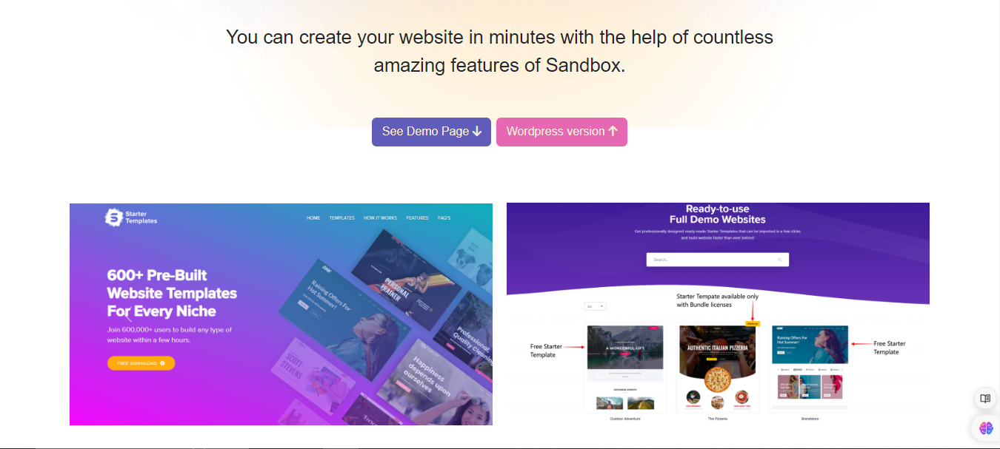

# Sandbox

Welcome to the Sandbox Clone Website! This project is a clone of the Sandbox website, offering seamless and impressive design both in web and responsive formats. 

## Features

- **Impressive Design:** Experience a seamless and impressive design, both in web and responsive formats, offering various portfolio designs and webpages.
- **Responsive Design:** The website is designed to be fully responsive, ensuring a consistent user experience across different devices.
- **Bootstrap Framework:** Utilizing Bootstrap framework heavily to create a visually appealing and modern design.
- **Angular Framework:** Angular is used as the primary framework for building the frontend, providing a robust and scalable architecture for managing components and logic.
- **HTML/CSS:** Standard markup and styling languages are used to create and style the website's layout and appearance.
- **Typescript:** Leveraging Typescript for logical functionalities.

## Quick Intro

### Diff sec of front page 
<div style="overflow: auto;">
    
    
</div>

<div style="overflow: auto;">
    
    
</div>


### Frontpage features
<div style="overflow: auto;">
    
    
</div>

<div style="overflow: auto;">
    
    
</div>

<div style="overflow: auto;">
    
</div>

### Demo-one Page features
<div style="overflow: auto;">
    
    
</div>

<div style="overflow: auto;">
    
    
</div>
     

## Getting Started

To get started with the project, follow these steps:

1. Clone the repository:
   ```
   git clone https://github.com/aryyan0701/sandbox_clone.git
   ```
2. Navigate into the project directory:
   ```
   cd your_project_name
   ```
3. Install dependencies:
   ```
   npm install
   ```
4. Start the development server:
   ```
   npm run start
   ```
5. Open your browser and visit `http://localhost:4200` to view the application.

## Usage

- Explore the various portfolio designs and webpages available on the website.
- Experience the seamless and impressive design across different devices.
- Enjoy the modern and visually appealing layout created using Bootstrap and Angular.

## Contributors

- [Aryan Kadam](https://github.com/aryan0701) - Project Lead & Developer

## License

This project is licensed under the MIT License - see the [LICENSE](LICENSE) file for details.

## Acknowledgements

- Bootstrap for providing a powerful and flexible design framework.
- Angular community for continuous support and updates.

## Further help

You can find the original website [here](https://preview.themeforest.net/item/sandbox-modern-multipurpose-bootstrap-5-template/full_screen_preview/32441701).
To get more help on the Angular CLI use `ng help` or go check out the [Angular CLI Overview and Command Reference](https://angular.io/cli) page.
